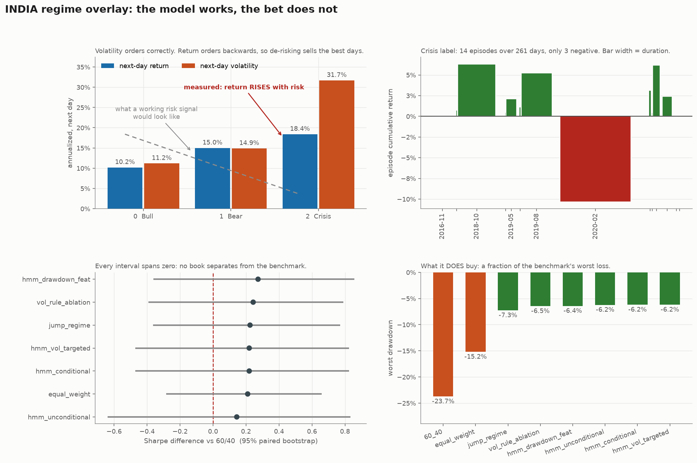
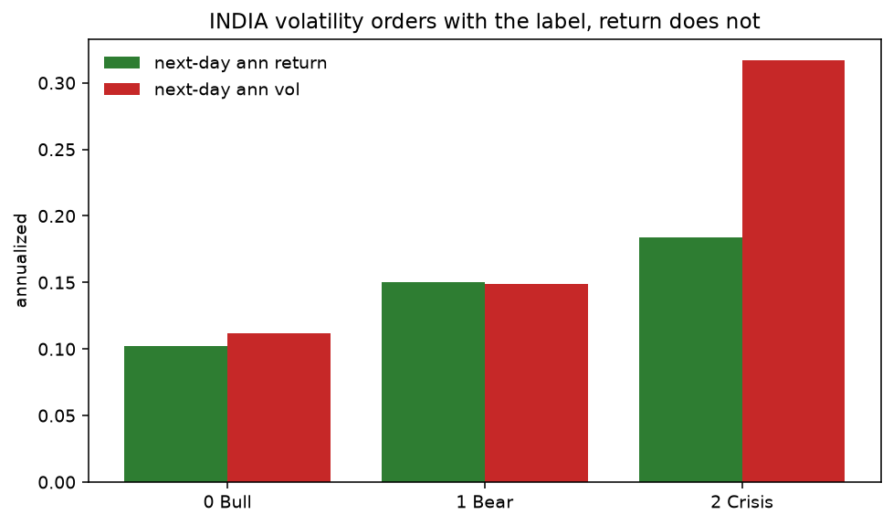
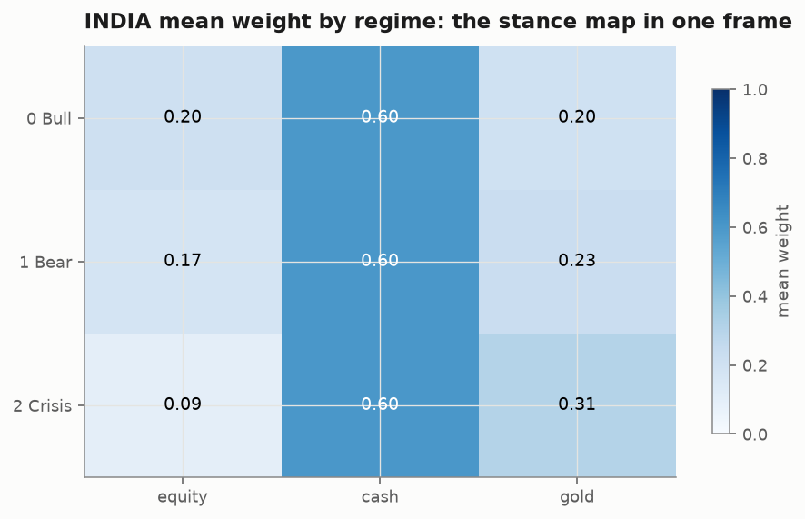
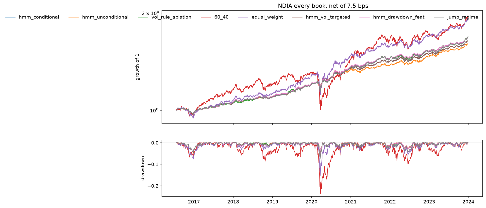
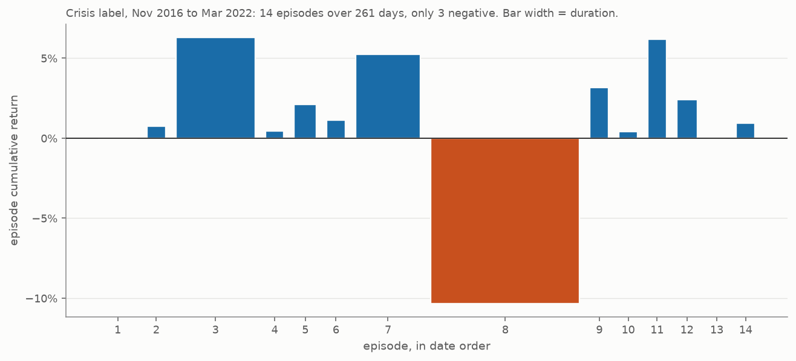
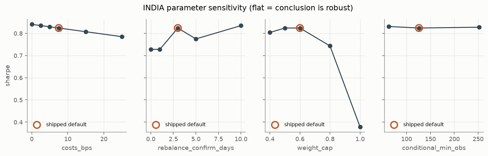
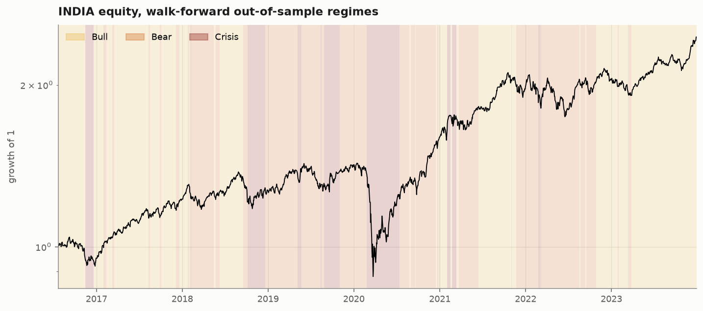

# Signals-Before-Storms: HMM Regime Detection for Tactical Asset Allocation in Python

[](LICENSE)
[](https://www.python.org/)
[](tests/)
[](https://github.com/astral-sh/ruff)
[](#the-finding)

**[Explore the results interactively](https://signals-before-storms.vercel.app)**; toggle any of
eight books, switch gross against net of costs, and switch India against the US to watch the
ranking change. The [full research log](https://signals-before-storms.vercel.app/story) sits
behind it.

**Signals-Before-Storms is an open-source quantitative finance research engine that detects hidden
market regimes (Bull, Bear, Crisis) with a Hidden Markov Model, then reallocates a portfolio across
equity, cash and gold using per-regime convex optimization, validated with a leak-proof expanding
walk-forward backtest.** It runs on Indian markets (NIFTY 50, GOLDBEES, LIQUIDBEES, India VIX) as
the primary universe and US markets (SPY, TLT, GLD, VIX) as an out-of-sample robustness check.

> **The honest headline: the regime overlay never separates from a simple 60/40 or equal-weight
> portfolio on risk-adjusted return.** Its Sharpe edge on India sits inside the noise, with every
> paired confidence interval against both benchmarks spanning zero. It does cut maximum drawdown by
> roughly two thirds on Indian data. This repository is published as a *rigorous negative result
> with a diagnosis*, not as a winning strategy, and it documents its own retracted finding. Full
> reasoning in [The finding](#the-finding).



**The entire argument, in reading order.** The model does what it was asked and finds real,
persistent states, but those states predict *variance*, not *direction* (top left). The evidence
behind any regime claim is far thinner than the day count suggests, 14 episodes rather than 261 days
(top right). No book separates from its benchmark once the comparison uses a paired difference test
instead of overlapping intervals (bottom left). What the overlay does buy is drawdown: a fraction of
the benchmark's worst loss (bottom right).

---

## TL;DR

| Question | Answer |
|---|---|
| **What does it do?** | Detects 3 hidden market regimes with an HMM, switches portfolio weights per regime via convex optimization |
| **Does the strategy work?** | No. No book separates from 60/40 or equal weight on Sharpe once the comparison uses a paired difference test, and every interval spans zero. It *does* cut max drawdown from -23.7% to -6.2% on India |
| **Why does it fail?** | The HMM finds **volatility** states, not **direction** states. Realized volatility is symmetric in sign and cannot tell a crash from a rebound |
| **Is the backtest leak-proof?** | Yes, and asserted by unit tests: causal features, train-only scaling, per-fold refit, causal decode, 1-day execution lag |
| **Are the results deflated?** | Yes. Deflated Sharpe at an honest 7-trial count, plus stationary-bootstrap confidence intervals |
| **Sample size** | 1,814 out-of-sample trading days (India), 1,886 (US), 2016-2023 |
| **Stack** | Python 3.11+, `hmmlearn`, `cvxpy`, `pandas`, `numpy`, `scipy`, `scikit-learn`, `yfinance`, `matplotlib` |

---

## The finding

Measured at the lag the strategy actually trades (regime label known at the close of day *t*,
return earned on day *t+1*):



| Regime label | India days | India ann. return | India ann. vol | US days | US ann. return | US ann. vol |
|---|---|---|---|---|---|---|
| 0 Bull | 821 | +10.2% | 11.2% | 665 | +10.9% | 8.7% |
| 1 Bear | 731 | +15.0% | 14.9% | 841 | +14.7% | 15.6% |
| 2 Crisis | 261 | +18.4% | 31.7% | 379 | +16.1% | 32.2% |

**Volatility orders perfectly with the label. Return orders backwards, on both universes.**

That single table explains the whole result. De-risking on the Crisis label means selling the
highest-returning days, because the violent rebounds of April 2020 and late 2022 are as volatile as
the crashes that preceded them. A state variable has to predict *direction* before a directional bet
on it can pay, and realized volatility is symmetric in sign by construction.

Confirmed independently by a second, structurally different estimator (a Statistical Jump Model,
which agrees with the HMM only 57.5% of the time) and on a second universe two decades apart in
market structure.

---

## How it works

```mermaid
flowchart LR
    A["Yahoo Finance<br/>NIFTY / gold / cash / VIX"] --> B["build_master<br/>log returns + vendor-error guard"]
    B --> C["build_features<br/>momentum, realized vol, VIX<br/>ALL causal, right-aligned"]
    C --> D{"Expanding<br/>walk-forward"}
    D -->|"train only"| E["StandardScaler<br/>fit on train rows only"]
    E --> F["HMM refit per fold<br/>hmmlearn, 3 states"]
    F --> G["Causal forward filter<br/>NEVER whole-sequence Viterbi"]
    G --> H["Regime label<br/>0 Bull / 1 Bear / 2 Crisis"]
    H --> I["Per-regime convex program<br/>cvxpy"]
    I --> J["run_book<br/>1-day lag + 7.5 bps cost"]
    J --> K["Deflated Sharpe<br/>paired bootstrap CI<br/>episode counts"]

    style G fill:#c62828,color:#fff
    style J fill:#2e7d32,color:#fff
    style K fill:#37474f,color:#fff
```



**Per-regime objectives** (each a distinct convex program solved with `cvxpy`, long-only, fully
invested, weight-capped):

| Regime | Objective | Rationale |
|---|---|---|
| 0 Bull | Maximize Sharpe | Calm market, take risk |
| 1 Bear | Minimize variance | Stressed, preserve capital |
| 2 Crisis | Minimize variance + hard equity cap | Violent, de-risk hard |



The stance map does exactly what it was told, and the figure shows what that costs: equity never
exceeds a quarter of the book. **The strategy is not taking too much risk, it is taking far too
little**, which is also why volatility targeting at 10% barely binds.

---

## Results

Every book, strategy and benchmark alike, runs through the **same cost engine** at 7.5 bps per unit
of turnover with a one-day execution lag. A benchmark costed on different terms is not a benchmark.

### India (primary universe, graded)

^NSEI / LIQUIDBEES.NS / GOLDBEES.NS / ^INDIAVIX, out-of-sample 2016-07-22 to 2023-12-29, n = 1,814.
Sharpe is measured against the **3.79% risk-free rate the cash sleeve actually paid**; scoring
against rf = 0 would hand every defensive book a free Sharpe for simply holding cash.

| Strategy | Ann. return | Ann. vol | Sharpe (net) | Sharpe (gross) | Sortino | Max DD | Calmar | Turnover/yr | DSR |
|---|---|---|---|---|---|---|---|---|---|
| HMM + drawdown feature | 7.5% | 4.0% | 0.877 | 0.896 | 1.291 | -6.4% | 1.169 | 0.99x | 0.805 |
| **Vol-threshold rule (ablation)** | 7.5% | 4.2% | 0.848 | 0.863 | 1.244 | -6.5% | 1.165 | 0.88x | 0.783 |
| Jump Model regimes | 7.6% | 4.3% | 0.829 | 0.833 | 1.204 | -7.3% | 1.038 | **0.24x** | 0.767 |
| **HMM, regime-conditional** | 7.2% | 3.9% | 0.824 | 0.841 | 1.211 | **-6.2%** | **1.161** | 0.87x | 0.764 |
| HMM + volatility targeting | 7.2% | 3.9% | 0.824 | 0.841 | 1.211 | -6.2% | 1.161 | 0.87x | 0.764 |
| Equal weight | 9.5% | 6.8% | 0.815 | 0.819 | 1.167 | -15.2% | 0.625 | 0.41x | 0.752 |
| HMM, unconditional | 6.9% | 3.9% | 0.748 | 0.758 | 1.097 | -6.2% | 1.103 | 0.50x | 0.697 |
| Static 60/40 (equity/cash) | 9.8% | 10.0% | 0.604 | 0.607 | 0.827 | -23.7% | 0.413 | 0.36x | 0.552 |



**Read the Sharpe column and the strategy is unremarkable.** No book here is statistically
distinguishable from either benchmark (established by a paired difference test, below). **Read max
drawdown and Calmar, the other two metrics the brief names, and the picture inverts**: -6.2% worst
drawdown against -15.2% and -23.7%, with Calmar roughly 1.9x and 2.8x the benchmarks. That is not
noise; it is the mechanical consequence of routing to minimum variance whenever the label is not
calm. The overlay buys drawdown protection and pays for it in return. Whether that trade is worth
making is a mandate question, not a statistical one.

The drawdown-feature variant tops the table and is **not** counted as a win: its success criterion
was pre-registered before any Sharpe was computed, and it failed on that criterion.

### US (robustness universe)

SPY / TLT / GLD / ^VIX, out-of-sample 2016-07-05 to 2023-12-29, n = 1,886, rf = 0, real bond leg.

| Strategy | Ann. return | Ann. vol | Sharpe (net) | Sortino | Max DD | Calmar | Turnover/yr | DSR |
|---|---|---|---|---|---|---|---|---|
| **Vol-threshold rule (ablation)** | **9.8%** | 10.3% | **0.958** | 1.369 | **-21.9%** | **0.446** | 3.61x | **0.863** |
| Static 60/40 | 7.5% | 11.5% | 0.690 | 0.956 | -27.6% | 0.273 | 0.41x | 0.643 |
| Jump Model regimes | 6.6% | 10.1% | 0.682 | 0.962 | -25.1% | 0.262 | **1.46x** | 0.636 |
| Equal weight | 5.9% | 9.6% | 0.650 | 0.921 | -23.0% | 0.258 | 0.42x | 0.602 |
| HMM + drawdown feature | 5.4% | 9.6% | 0.590 | 0.840 | -28.0% | 0.191 | 3.88x | 0.538 |
| HMM + volatility targeting | 5.0% | 9.4% | 0.562 | 0.793 | -27.3% | 0.182 | 4.10x | 0.508 |
| HMM, regime-conditional | 4.9% | 9.6% | 0.542 | 0.765 | -28.7% | 0.170 | 4.19x | 0.486 |
| HMM, unconditional | 4.8% | 9.6% | 0.535 | 0.758 | -27.4% | 0.174 | 2.74x | 0.478 |

**The US does not reproduce India, and saying so is the point of running it.** No HMM book improves
on either benchmark on Sharpe or Calmar, and the drawdown protection that vindicated the overlay on
India does not reappear: the best HMM drawdown is level with 60/40 and well behind equal weight at
-23.0%. Minimum variance had nowhere to hide in 2022, when bonds fell alongside equities. A result that held on one market and
was quietly assumed to hold on the other would be the more comfortable story. It is not the one the
data tells.

---

## What makes this different

Most public backtest repositories report a Sharpe ratio and stop. These are the checks that changed
the conclusion here, each one implemented, tested, and documented.

### 1. Leak-proofing asserted by tests, not claimed in prose

Lookahead bias is the single easiest way to produce a beautiful, worthless backtest. Five defences,
each pinned by a unit test:

- **Causal features** - every rolling window is right-aligned, so a value at *t* uses only rows at
  or before *t*. Tested by comparing features on a prefix against features on the full series.
- **Train-only standardization** - `StandardScaler` is fit inside each fold on training rows alone.
- **Per-fold model refit** - the HMM is re-fit from scratch in every fold, never once globally.
- **Causal decoding** - test labels come from an O(n) log-space forward filter. Whole-sequence
  Viterbi uses the entire path *including the future*, so it is used for descriptive overlays only
  and never for a traded label.
- **One-day execution lag** - a label seen at the close of *t* can only move PnL at *t+1*, enforced
  in a single shared code path so every strategy inherits it.

### 2. Effective sample size: episodes, not days

**`days` is not a sample size.** A claim about a regime is supported by how many times that regime
occurred, not how many rows it spanned.



| Label | India days | India **episodes** | Ann. return | Ex-largest episode |
|---|---|---|---|---|
| 0 Bull | 822 | 27 | +10.2% | +2.7% |
| 1 Bear | 731 | 30 | +15.0% | +13.1% |
| 2 Crisis | 261 | **14** | +18.4% | **+53.6%** |

The India crisis label spans 261 days, which sounds like evidence, across just **14 episodes**, only
3 of which lost money. Drop the single longest (COVID) and the label runs **+53.6%** annualized.

**This check retracted the project's own apparent discovery.** A Jump Model crisis label reading
-17.1% over 94 days was written up as the only directional state found anywhere in this work. It was
**two episodes**: COVID (-10.70%) and one positive 30-day run (+4.41%). Ex-COVID it runs +30.17%,
the same backwards ordering as everything else, and a cross-tabulation showed all 94 days sitting
*inside* the HMM's own crisis label. The effective sample was one event. The retraction is
documented here rather than quietly dropped.

### 3. Comparisons use a paired difference test

Two overlapping confidence intervals do **not** mean two strategies are indistinguishable. Each
marginal interval asks whether one book's Sharpe differs from zero; the question is whether the
*gap* differs from zero, which needs the interval of the difference, resampled on the same dates for
both books. Since every book holds the same assets on the same days, differencing cancels the shared
market move and the paired interval comes out roughly **three times tighter**.

| Book | vs 60/40 | vs equal weight |
|---|---|---|
| HMM + drawdown feature | +0.273 (-0.36, +0.86) | +0.063 (-0.19, +0.28) |
| Vol-threshold rule | +0.244 (-0.39, +0.79) | +0.033 (-0.23, +0.28) |
| HMM, conditional | +0.220 (-0.47, +0.83) | +0.009 (-0.28, +0.26) |

**Every interval spans zero, on both universes.** The "it is all noise" reading survives, and is now
earned rather than assumed. It also sharpens one claim: on the US, the volatility rule's *marginal*
interval excludes zero, which says only that its Sharpe beats zero. Paired against 60/40 it is
+0.268 (-0.029, +0.559), so even the ablation that wins the US table cannot be said to beat the
benchmarks.

### 4. Deflated Sharpe with an honest trial count

A Sharpe reported once, from one strategy out of several tried, is a biased number. The deflated
Sharpe charges for the number of variants actually searched: **7 trials**, stated openly. It was
0.928 for the volatility rule at 4 trials, and searching three more ideas lowered every number in
that column. That is exactly what deflation is for.

Confidence intervals use a Politis-Romano stationary bootstrap with the block length read off the
data (Politis-White), not guessed.

### 5. Parameter sensitivity reported as a surface



Every knob was a single unexamined value until it was swept. The sweep reports the whole surface and
**adopts nothing**, because picking the best cell would be a search and would owe the deflated
Sharpe another trial.

- **Costs are not the story.** Sharpe moves only 0.841 to 0.785 across free trading to 25 bps. At
  zero cost the strategy still does not beat its benchmarks, which is a cleaner statement of the
  result than any net number.
- **Disclosed rather than buried:** `weight_cap` and `rebalance_confirm_days` are *not* flat, and the
  shipped defaults sit at local Sharpe optima. Both were fixed before any result was computed and
  neither is re-chosen here, but a reader is entitled to be told.

### 6. Honest benchmarks and a no-model ablation

The strongest control in the repo is a **two-line volatility-threshold rule**: same optimizer, same
costs, same walk-forward, but regimes come from a trailing-vol quantile instead of the HMM. If the
HMM cannot beat that, the HMM is decoration. On the US, the rule wins outright (0.958 vs 0.542).

### 7. Figures are designed, and the palette is validated rather than chosen

Every chart is generated by `src/regime_shift/style.py`, one module that owns typography, chrome and
colour, so no figure carries a default that nobody decided on. Two rules:

- **Colour is computed.** `tools/validate_palette.py` checks every palette and `tests/test_style.py`
  fails the build if one stops clearing the floors: 3:1 contrast against the chart surface, 8 units
  of CIE76 separation after protanope and deuteranope simulation, and 90 degrees of hue separation
  for any palette that encodes by hue. It has caught two real defects in palettes actually shipped
  here: the old Bear amber at **1.92:1** contrast, and the Bull gold that replaced it at **1.80:1**,
  both under the 3:1 floor.

  It also corrected this README. An earlier version claimed the old green/amber/red triad had a
  worst adjacent pair "separated by ~3 units where 8 is the floor". That does not reproduce:
  measured, the triad's worst pair is **17.2** units, well clear, because those colours differ in
  lightness. The real defect is one a distance metric cannot see. Simulate a dichromat and the
  triad collapses to a single hue, its pairs **0.6, 1.1 and 1.4 degrees** apart, so the only thing
  separating them is being lighter or darker. That is why sign is encoded blue against orange
  (166.6 degrees) rather than green against red (1.1), and why three figures that had been drawing
  sign as green-versus-red no longer do.
- **Regimes are ordinal, so they get an ordinal encoding.** Bull to Bear to Crisis is an ordered
  scale, so it uses a lightness ramp rather than three arbitrary hues. That states the ordering the
  data actually has, and it survives colour blindness because lightness does.

Charts also carry the finding in a subtitle and annotate the point the reader would otherwise miss,
so no figure here depends on surrounding prose to be understood.

### 8. Vendor data guarded, not trusted

GOLDBEES.NS on Yahoo prints a 100x round trip over 2019-12-19 to 2019-12-23 (log returns of -4.61
then +4.61). Two bad prints in 2,193 rows. Left alone they inflate gold's return standard deviation
from 0.011 to 0.139 and poison every Indian covariance, regime fit and Sharpe. The guard rejects any
daily |log return| above 0.5 with a loud warning, and a test pins that a -13% crash day survives it.

---

## Regime detection in action



Out-of-sample regime labels shaded behind the NIFTY equity curve. Nothing here had access to its own
future. With no future information the causal filter independently flags February 2018, Q4 2018,
COVID and 2022.

The transition matrix diagonal runs 0.97 to 0.98, so the states are genuinely persistent rather than
a coin flip relabelled. The corner zeros matter too: Bull never jumps straight to Crisis and Crisis
never jumps straight to Bull, so the market always passes through the middle state. That is
economically sensible behaviour the model was never told to produce.

---

## FAQ

**What is a market regime?**
A market regime is a persistent state of market behaviour, such as calm rising (Bull), stressed
falling (Bear), or violent high-volatility (Crisis). Regimes are not directly observable; only their
consequences, prices and volatility, are.

**What is a Hidden Markov Model used for in finance?**
A Hidden Markov Model (HMM) infers an unobservable state sequence from observable data. In finance
it is used to label market regimes from returns and volatility features, and to estimate the
probability of switching between regimes. This project uses `hmmlearn`'s `GaussianHMM` with 3
states.

**What is lookahead bias and how does this repo prevent it?**
Lookahead bias occurs when a backtest uses information that would not have been available at the
time of the decision. It is prevented here with causal (right-aligned) features, standardization
fitted only on training data, per-fold model refitting, causal forward-filter decoding instead of
whole-sequence Viterbi, and a one-day execution lag. Each defence is asserted by a unit test.

**Does HMM regime detection actually improve portfolio returns?**
On this data, no. The HMM identifies volatility regimes, and volatility carries no directional
information: next-day returns rise with the volatility label rather than falling. It does reduce
maximum drawdown substantially (-6.2% versus -23.7% for 60/40 on Indian data).

**What is a deflated Sharpe ratio?**
The deflated Sharpe ratio (Bailey and Lopez de Prado) adjusts an observed Sharpe ratio for the
number of strategy variants tested, correcting the selection bias that makes the best of many
backtests look better than it is. This project reports it at an honest count of 7 trials.

**Why report a negative result?**
Because it is the truthful one, and because a negative result with a diagnosis is more useful than a
tuned positive with an unexamined one. The diagnosis here (volatility states carry no directional
information) is a reusable finding that generalizes beyond this codebase.

**Can I use this for live trading?**
No. This is research and educational code, and the headline finding is that the strategy does not
separate from simple benchmarks on risk-adjusted return, and underperforms them outright on the US
universe. See [Disclaimer](#disclaimer).

**What markets and data does it use?**
India (primary): NIFTY 50 (^NSEI), GOLDBEES.NS, LIQUIDBEES.NS, India VIX (^INDIAVIX). US
(robustness): SPY, TLT, GLD, ^VIX. Data comes from Yahoo Finance via `yfinance`, plus macro from
FRED where it is reachable and a Yahoo credit-spread proxy where it is not. 2015-2023, daily.

---

## Quickstart

```bash
git clone https://github.com/DogInfantry/Signals-Before-Storms.git
cd Signals-Before-Storms
uv sync --extra jump
uv run pytest -q                            # 67 tests
uv run python notebooks/real_run.py india   # primary universe, 17 figures
uv run python notebooks/real_run.py us      # robustness universe
uv run python tools/export_site_data.py all # refresh the data the site draws from
```

The `jump` extra pulls `jumpmodels` for the second regime engine. Without it the pipeline still runs
end to end and simply skips the Jump Model book.

The first run downloads prices from Yahoo and caches them under `data/`; every later run is offline
and deterministic. India is the default because it is the graded universe.

`notebooks/driver.ipynb` runs the same pipeline India-first with the full narrative and the US as a
robustness section, committed with all outputs and every figure embedded. Re-execute in place with:

```bash
uv run papermill notebooks/driver.ipynb notebooks/driver.ipynb --kernel python3
```

## Layout

There is also an interactive version of the results. `docs/` is a static site with no build step:
`index.html` is a one-screen panel where the equity curves, drawdowns, regime bands, scorecard and
paired-difference test are all live, so a reader can toggle books, switch gross against net of
costs, and switch India against the US rather than take a screenshot's word for it. `story.html`
carries the full research log. `tools/export_site_data.py` writes the JSON it reads, using the same
functions that print the scorecard, so the page cannot drift from the tables above. Serve it with
`python -m http.server --directory docs`; opening the file directly will not work, because `fetch`
is blocked on the `file://` origin.

```
src/regime_shift/
  data.py         yfinance + FRED loading, credit proxies, vendor-error guard
  features.py     causal momentum / realized vol / VIX features
  regime.py       RegimeModel (HMM or Jump), canonical labels, episodes
  walkforward.py  expanding splits, train-only scaling, causal decode
  optimize.py     per-regime convex programs (cvxpy)
  backtest.py     shared cost engine, execution lag, sensitivity sweep
  metrics.py      Sharpe/Sortino/Calmar, deflated Sharpe, paired bootstrap
  benchmarks.py   60/40, equal weight, no-HMM volatility ablation
  plots.py        16 figure helpers
config/config.yaml  every knob: universe, dates, windows, costs, seed
notebooks/          top-to-bottom driver script and notebook
tests/              67 tests, leak-proofing, metric and palette checks
tools/              palette validator, site data exporter
docs/               static site: interactive panel, research log, figures, exported JSON
```

## Why the key decisions

- **3 regimes (Bull / Bear / Crisis):** chosen to match the economic states allocated against, then
  checked with a BIC sweep rather than assumed. The sweep supports it on the graded Indian universe
  (a clear elbow at three: the 3 to 4 step buys only 392 of fit against 6,256 for 2 to 3) and does
  not support it on the US. Both are reported.
- **These features:** multi-window momentum (direction), realized volatility (stress), VIX level and
  its daily change. Nine columns per universe, and **deliberately no macro among them**. Macro is
  loaded, plotted and interpreted, but it is kept out of the model on purpose: `build_features`
  promotes any column that is not an asset return and not VIX into a state variable, so wiring macro
  in would widen the feature matrix, move every number here, and spend a deflated-Sharpe trial. It
  is measured and left out, which is what declaring a trial count in advance is for.
- **Macro comes from Yahoo, because FRED does not answer here.** FRED is the source the brief names
  and `data.load_macro` requests it first, keylessly. On this network `fred.stlouisfed.org` times out
  from `requests` even where other hosts return 200, and DBnomics does not mirror the FRED provider
  at all, so the fallback is `data.load_credit_proxies`: a corporate bond fund measured against a
  Treasury fund of similar duration is a credit spread expressed in prices, from the one vendor that
  does respond. Both entry points print which leg landed. The proxy earns its place by separating
  two episodes realized volatility cannot tell apart: through the COVID crash the high-yield spread
  widens +0.284, and through the 2022 rates selloff it moves -0.025, the other way, while volatility
  rises in both. That signed behaviour is exactly what VIX and realized volatility provably cannot
  supply, and it is the shape any future directional state variable would need.
- **Only equity drives the regime.** The state is a property of the market being timed, not of the
  sleeves used to express the view. This was a live bug: `cash_ret` was missing from the exclusion
  list, so India silently fitted a 10th feature the US never saw, which broke the like-for-like
  comparison and depressed every Indian HMM score (fixing it moved conditional Sharpe 0.744 to
  0.824). A test now asserts no `*_ret` column can reach the feature matrix.
- **No Indian bond sleeve, because no usable one exists here.** Every candidate duration ETF on
  Yahoo was measured before rejection: SETF10GILT.NS shows 39.0% annualized volatility with 21.7%
  zero-return days, LTGILTBEES.NS 15.7% with 9.1%, and both start mid-sample, which would truncate
  the out-of-sample window. A 10-year G-Sec ETF does not have 39% volatility; that is thin-trading
  noise around NAV. LIQUIDBEES.NS is used instead and is called cash, not a bond. **The 60/40
  benchmark routes its 40% to that cash sleeve**, because dropping the leg renormalizes it to 100%
  NIFTY and would judge a defensive strategy against a pure-equity book at four times its volatility.
- **Benchmarks share the cost engine:** every book runs through the same `run_book` loop.

## Reproducibility

Seeds are fixed in `config/config.yaml`. Downloaded data is cached under `data/` so reruns are
offline and deterministic.

The config deliberately keeps the volatility-ranked variant even though the return-ranked one scored
higher, because silently promoting the better-scoring variant is the selection bias the deflated
Sharpe exists to catch. For the same reason the drawdown feature stays off by default despite topping
the India table: it failed its pre-registered test.

The deflated Sharpe is quoted at 7 trials throughout. The cash-leg 60/40 and the `cash_ret` fix are a
benchmark and a bug fix, not searched variants, so neither moves that count. Neither does the
parameter sweep: it reports a surface and adopts nothing.

## Figures

Sixteen per universe, written to `results/` by the driver and embedded in the notebook. Seven are
committed under `docs/img/` for this README.

`story` (the 2x2 composite this README opens with) · `returns` (raw daily returns with log-count
marginals) · `feature_sanity` (vol_21 and VIX with COVID and 2022 shaded) · `label_profile` (the
central finding) · `episode_bars` (effective sample size) · `weight_stack` · `regime_weights` ·
`gross_vs_net` (compounding cost wedge) · `sharpe_forest` · `rolling_sharpe` · `sensitivity` ·
`bic_curve` · `regime_overlay` · `equity_drawdown` · `transition_heatmap` · `macro_spread` (the
credit spread under the same regimes, the one signed variable in the project)

## Tech stack

`Python 3.11+` · `hmmlearn` (Gaussian HMM) · `cvxpy` (convex optimization) · `pandas` · `numpy` ·
`scipy` · `scikit-learn` · `yfinance` (market data) · `matplotlib` · `jumpmodels` (optional second
regime engine) · `pydantic` (typed config) · `uv` (packaging) · `pytest` · `ruff`

## License and attribution

Apache License 2.0. See [LICENSE](LICENSE).

Attribution is a condition of the license, not a courtesy: Section 4 requires anyone redistributing
this work or a derivative to retain the copyright and attribution notices and to reproduce the
contents of [NOTICE](NOTICE). If you use this in a paper, post, product, model or presentation, cite
it as:

> Anklesh Rawat, "Signals-Before-Storms: a macro-aware tactical asset allocation engine", 2026.
> https://github.com/DogInfantry/Signals-Before-Storms

Market data is fetched at runtime from Yahoo Finance and FRED, is subject to their terms, and is not
redistributed here.

## Disclaimer

Research and educational code. Nothing here is investment advice, and none of these results are a
recommendation to trade. The headline finding is that the strategy does not separate from simple
benchmarks on risk-adjusted return, and underperforms them outright on the US universe.

---

**Keywords:** hidden markov model finance · market regime detection · tactical asset allocation ·
regime switching model python · walk-forward validation · backtesting framework · lookahead bias ·
deflated sharpe ratio · convex portfolio optimization · cvxpy · hmmlearn · quantitative finance
research · NIFTY 50 backtest · Indian equity markets · systematic trading research
